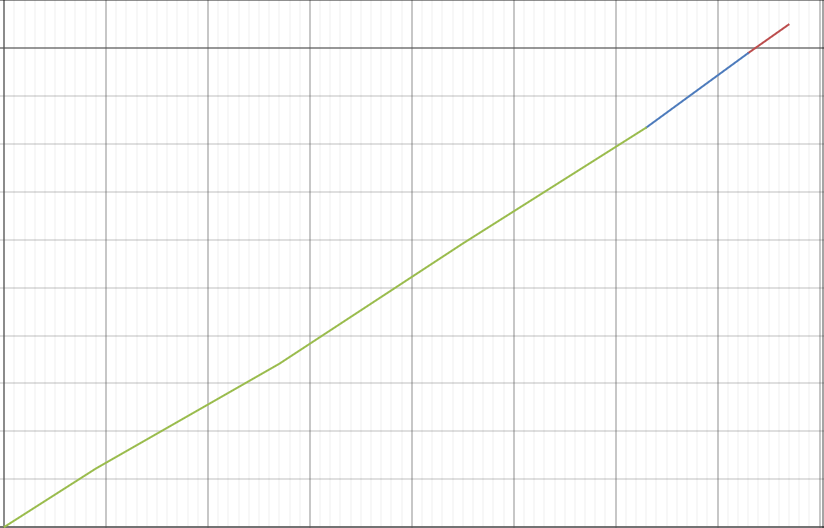

# Plotting Tool
P1 | OnlineGraph | P2
- Take data from data stream
- Plots data in real time (renders x,y on graph)
- Run in terminal 
- Run via popen
- Aggregate Rendered Plot
- Use threading to de-couple taking in data, processing and rendering
- Not batch plotting simialr to GNUPlot, online


## Buffer
Pipe capacity fixed at kernel level
As of linux 2.6 pipe capacity is 16 pages (65,365 bytes)
Page - fixed length contigous block of virtual memory

## Thread - so far
Exist three threads, **reader**, **processor** and **render**
### Reader Thread
- Read reads byte stream from the terminal, data from standard input
S- ends data to 'processor' thread
- Reads standard input line by line from terminal (as it comes)
- Data as of now in form of two numbers x,y
- **As of now** no way to read byte stream quickly, just using rust library
- Data (x,y string) passed to processor thread using Multiple Producer Single Consumer library 
- Is the transmiter transmitter in MPSC (tx)
### Processor Thread
- Takes data from Reader thread via MPSC, is receiver (rx)
- Receives single string line, from tx, containing (x,y)  
- Have to get x,y out of string, split string and convert to int
- Print x,y, x average and y average
### Render Thread
- Takes x,y value from Processor thread


## Thread - Ideas
### Reader Thread
- Look into way to increase performance of reading from standard input, pipe may be bottleneck
- Transmit to shared memory? Useful for multiple processor threads working parralel? 

### Processor Thread
- Multiple processor threads? Processing can be done in parralel for each value passed in, process multiple at a time, less queuing to be processed

### Render Thread
- Takes x,y value from Processor thread
- Plots x,y value to GUI
- Can to use Plotter (rust library) inside a GUI, as of now plotter creates .png static image, no way to live plot (yet)

## Aggregate Data
**Use plotter graphic as store of memory**<br>Instead of storing the actual value, reference the plot as a point to get value
<br>
Data not stored in memory, GUI on screen is all the data
<br>
If you want a value from memory, click on Plot (or code reference plot)


## Rust GUI's- big concern & hurdle 15-10-2023, should I use rust?
Want something that updates live, not hard to learn, exist
* Druid - retained
* Relm
* Iced
* Conrad - immediate
* Egui - immediate, native, little documentation
* GTK.rs - retained, non native

### Retained Mode
* Persistent tree of objects
* Event bounded

### Immediate Mode - more suitable for this project
[More information](https://oandre.gal/concepts/immediate-mode-vs-retained-mode/)
* **Stateless**- don't ratain state between frames, entire GUI build between frames
* **Transcient** - GUI rendered online


#### Rust concerns
* I am new to it
* Little documentation for native GUIs (egui, druid) which are most performent
* Documentation exists for non-native GUI, gtk, matplot but not performent
#### Rust advantage
* Memory handling
* Good language to know in the coming years
* Performent


Simple Changes just here to test

## Mutex
external crates that provide advanced and specialized concurrency primitives. Some popular ones include crossbeam, tokio, and async-std.
<br>
**RwLock** - allows multiple threads to read the data simultaneously. If you have a scenario where reads are more frequent than writes


cargo run --bin writer | (cd /home/thomas/FinalYearProject/online-graph/plot_test && cargo run --bin plot_test)

Criterion is rust create to benchmark, measure time


## 4/11/23
Idea now is to have a sliding window, split into three sections as follows
1) Raw Data - raw data from stream plotted, no downsampling, plotted live
2) Transition - Section where raw data is actually downsampled
3) DownSampled - Collection of transition sections forming a continous plot of downsampled data

This form a plot of contigous data, but there exist a cut off between the raw and downsampled. The sliding window determines when raw data is cut-off and downsampled. <br><br>
**You are essentially** moving the downsampling process on the data from before it is plotted (when it directly comes from stdin) to after it is plotted

Think off as split into three windows, the raw data window width is dynamic, once it fills up all the data is moved into the transition window to be downsampled, once downsampled it is moved into the D.S window. 

**Exist Few Problems**
* Transition create bottleneck, if takes a while to downsample the raw data in transition end up blocking R.D window
* Don't know whether to downsample the DownSampled winodow, if
  - **not done** means program memory grows and older data not downsampled, use retained GUI
  - **is done** downsampled then can create bottleneck between Transition, waiting for this section to downsample, **overcome** by having fixed size on this section, thus doesn't grow and fixed downsample time

## 7-11-23 - Version 1<br>
Exist three threads<br>
1) Raw Data, rd - contain 'values' vector, which are values to be plotted
2) Downsample, ds - handles downsampling chunk of the 'values' vector
3) Egui, eg - actual egui window, plotting the values live

* On launch, rawdata module is assigned read write lock
* rd ds and egui threads spawned. 

* rd thread reads in from standard input, and using the write lock appends the read in x,y points to the raw data 'values' vector

* Egui thread constantly reads rawdata 'values' vector, when new value pushed, egui redraws entire plot thus drawing the new points

* ds thread counts read the 'values' vector length, when 10 values pushed
* - ds take a copy of the previous 10 values (from the end) 
  - downsamples them (remove half)
  - Sends the downsampled vector to rd thread via mpsc channel
  - rd (having the write lock) amends the downsampled chunk to the vector

* Both egui and ds both share the read lock, only rd has the write lock
* **Contention does arise when rd has to insert downsampled chunk into 'values' vector, stops reading in from standard input**

**Problem, big problem 9-11-23**
potential efficiency issue with using RwLock in a situation where writes are frequent and reads are constant. This setup can lead to what's known as "write starvation," where the reader(s) may frequently block the writer(s) from accessing the data, especially if there are many reader threads or if the reader holds the lock for a long duration. Additionally, if the downsampler is constantly checking the length of the vector in a tight loop, it can lead to a high contention situation, which is inefficient.

## 12 - 11 - 2023
### Looked into lock-free data structures
* Such as 'crossbeam' which provide such as 'SegQueue', which allow concurrent reads and writes without using locks since they use atomics. 
* All of the lock-free data structures don't support **non-destructive reads or iteration over elements** which means cannot get all elements of vector, simply can't return entire vector, designed for concurrent enqueueing and dequeueing operations 
* Since egui/druid require access to the entire vector to be plotted, as they are data driven, and l.f.d.s don't allow the reading of an entire vector, they cannot be used
* Hence, a RW-lock is the best mechanism for thread-safe concurrency
### Looked into using thread-pools for downsampling
* Instead of single downsampling thread, can use thread pools which will downsamples different chunks coming in from r.d in **parallel**, more performent
* Looked into *Rayon* which is an API that looks after thread pooling
* Looked into standard library thread pooling, will have look into more tomorrow

Key takeway is to stick with RW-lock, can't use lock free data structure that allows good concurrency access to shared datastructure

## 13 - 11- 2023
Going to use a thread pool instead of single D.S thread to downsample. Done if downsample rate slower than rate at which chunks comes in, mutliple threads of pool can downsample in parralel. 
* **Thread pools used primrarily for CPU-bound tasks**, downsampling is CPU instensive, doing math on vector of points. This is why I am not using anync methods for downsampling, async offers concurrency but not parallelism

12-11-23
Get simple crossbeam demo working
Contain r.d thread writing to vector, egui thread reading from vector, should be no locking

Could use DashMap, is a hashmap, could use to store times as keys

So is there no concurrent queue crate in rust that allows non Destructive Reads?I no longer mind if it uses locks or mutual exclusion, anything quicker than a RW lock and not a buffer

* Look into
* * Atomic signal
* * Lock granularity
* * Thread pools 


## 13 - 11- 2023
**To get working**
1) Fix off by one using crossbeam channel send
   * Be sure to drop the locks, using a Reader Get Chunk method, implement crossbeam, not using atomics as no polling
2) Downsample get Descriptive statistics points per second
3) Plot as boxplot, switch to time series

Must choose between the following statistical libraries in rust
statrs - https://github.com/statrs-dev/statrs
incr_stats - https://github.com/garyboone/incr_stats
Using plotters for now, no crate to outright get quartiles

Look into using this **ndarray** - https://docs.rs/ndarray/latest/ndarray/

## 5-12-2023 
**Problem with current buffer method** 
* R (the R.D.T)
* H sees length is 10
* Set flag true
* R check condition, see R true
* Crucially, while this check occurs, since H is in a loop, it sees the length is still 10, so it beings the downsample process during the remove
* So R removes the points (keep in mind H is still downsampling)
* R sets the flag to false
* Crucially, when R finishes the remove and sets the flag to false, H sets the downsample flag to true (since it fished the downsample) right after
* Now the flag is true again
* R appends a point
* R sees the flag is true (based on when H saw the length was 10)
* R tries to remove but failes

**H always see stale data, here is where problem lies**
* R.D has the live view of the data
* Since H.D reads the data from R.D vector, it will always have a stale view of the data
* Currently, H.D polls length of R.D vector, downsamples, then tells R.D to delete chunk
* Since has a view of stale data, therefore always risk of race condition

## Solution - change R.D concerns
* R.D now writes and checks length, R.D thread has full access to R.D thread## 17 - 12 - 2023

Race Condition Window: There's still a small window for a race condition. After H checks the flag and before it starts the downsampling, R could potentially change the state. This window might be small, but in highly concurrent systems, even tiny windows can lead to issues.

Dependency on Flag State: This approach heavily relies on the accurate and timely update of the PROCESS_FLAG. Any delay or missed update could lead to incorrect behavior.

Stale Data Risk: If R is appending data very quickly, there's a risk that H might act on stale data. When H decides not to downsample because the flag is true, R might have already appended more data, changing the situation by the time H checks again.

## 17 - 12 - 2023
data streams in from standard input, the data is in the form of two floating points numbers think of as x,y. The async thread (call it r.d) appends the x,y values to a vector, called 'points'. The async thread monitors the length, after N amount of points (lets say 10 points) are added, another thread, (call it h.d) aggregates the chunk of points and appends the aggregate statistics to another vector, called 'statistics'. Once the aggregate stats for a chunk is appended to 'statistics' vector, the async thread r.d. removes the chunk of points.
Think of r.d as a sliding window, when certain amount read in removes the last chunk while reading in new points at the same time.

The egui thread plots both the 'points' vector with the raw data steaming in and being deleted and the statistics vector, with the aggregate statistics being added incrementally (thus removing the the chunk it represents from 'points')

## 24 - 01 - 2023
Considered using **Estimated Moving Average** which 
* tracks the average value of a series over time
* Calculates average for all points, giving more weight to more recent data, less to older. So is over entire data set not just window
* Plots trends more similar raw data as it comes in, also not waiting on window to fill up, get average as point comes in
* Average is for entire collection of points, not a bucket, so more representative of entire trend

How ever decided to not use it now, continue using buckets for now, may implement later as...
1) Only calculate average, not statistical values which are important and can be done via sliding window
2) Does not work aggregate all points, just gets average
3) While smoother, not too far off average for a winow

##### Will use EMA near end, as a user option, as a **hybrid** appraoch
So the EMA is calculated in parralel, when a bucket is full all the stats will be obtained for that bucket (min,max,count) but the average won't be calculate from the points in the bucket alone, it will be a snapshot of the EMA at the time the bucket is filled/created

EMA would provide a smooth trend line that is continuously updated with each new data point

## 25-01-23
Spent the day looking at ways to dynamically adjust the tumbling window size. The window size is static, this is not good in cases when the variance fluctuates. A shorter window is necessary for high variance to extract detail, while a larger window is need for low variance since not much to represent.
Will add times aggregation, but this seems most important. 
Planning to use r.d plot to capture variance, then with live variance change the tumbling window size. 

### LOOK INTO PAGE HINKLEY METHOD

## 26-01-23
Will need to write, look into Adaptive Window

## 27-01-23
Will need to write, look into Adaptive Window

## 28-01-23 
Getting ADWIN to work with Rust
Got github Adwin (https://github.com/Patrick-Harned/adwin/tree/master) to work,however not useful as
* Uses a sliding, not tumbling, window
* Window size remains constant
* Mainly used to detect drift which is used for ML, not for aggregating the window

Thus will have to create my own

Got a working version on ADWIN in rust, does not plot to EGUI but aggregates.
Have window, split into 2, N1 and N2. N1 is aggregated and plotted while N2 becomes the new tumbling window

## 30-01-23 
Considered using mean and variation in this scenario of 
'1,101
2,105
3,104
4,106
5,201
6,205
7,204
8,206'

Both sets [1-4] and [5-8] have a variance of 11.33 however the range between them is 100, can solve this by taking mean into account means for both sets different.

Going to take a break from adaptive windowing to focus on other parts of the project, will look into focusing on using variation instead of mean. Here is all the notes i have on it

The problem is the ADWIN algorithm uses the mean to compare sub-windows, however the mean is the central tendency of the data or shifts in the central value
I want to change it to use variance, as variance is a better measure of fluctuations of the data.
I want High fluctuations to mean a smaller window size and small fluctuation to mean a larger window size

using variance to detect changes identifies transitions from high-fluctuation to low-fluctuation periods (or vice versa) as significant, even if the mean remains relatively constant.


### Adwin algorithm has a issue- need to fix
When the delta is small and the streaming rate is high (10 milliseconds) the raw-data line can jump around. May be due to N2 vector always being split up

## 02-01-23 
Facing a big problem.
Yesterday determined in order for user to be able to use different aggregation approaches, Interval, Count and Adwin, the 'strategy pattern' must be used.
Strategy pattern allows for the implemetation of different algorithms depending on user selection at run time. 
Implement S.P by creating an abstract interface that contains methods that all algorithms share. 
Each algorithm creates concrete methods of interface with their own implementation

Currently Interval, Count and Adwin have common methods
* Add - addpend IO to vector
* Check - Condition to check if chunk should be aggregated
* Aggregate - To actually aggregate the chunk
* Remove - remove chunk and repalace with aggregate point

Now I am trying to combine the Adwin with the current Interval aggregation. The interval aggregation has loop
Line 67 in text file
Going to create interface first,then go back and change loop. 
Both interval and adwin share add, check, aggregate remove methods, so can create interface. 
Contention lie in where to but check condition in loop to accomodate both. 
Interval loop require seperate branch to receive interval tick message from channel
Adwin/Count don't require seperate branch as add and check condition method combined, thus for every add the check condition is called. 

## 05-01-23
Weirdest bug, on the strategy pattern when running the interval strategy if you zoom out at the start of runnning the program the aggregation is different to if don't zoom out
Basically, upon running the program if you zoom out straight away the interval still works but it is not the same as not zoom out

The key thing is both the aggregation means, both length, x mean and y mean of chunk are the exact same, thus it is to do with EGUI. 
When zoom out straight away the plot contains less detail

This also happens for the Adwin strategy pattern, the exact same problem with zooming in/out

### solved? Egui upon launch plots eveything in relation to newest point added, thus when new points are constantly added the framing/scaling of the plot window shifts around to keep the newest point in frame. 

## 06-01-23
Split in the road reached, when instatiating 'my_app' with two genetics, MyApp<T,U> 3 possible specific types for each. So for DataStrategy there exists Count, Interval and Adwin.
Thus Rust cannot infer specific types for the genric parameters in MyApp<T, U>, since three possible combinations each

So the problem is,the type of strategy the user selects "count", "interval" or "adwin" is not known until the program is ran with the user input. This means the type of the MyApp<T,U> generic can't be known at compile time, since it depends on the run-time input from the user. In order to determine a type of a generic at run-time dynamic distpatch must be used. Dynamic dispatch allows code to be written for different types that implement a particular trait withouth knowing their concrete type at compile time. 

For now will use dynamic dispatch, later try implement static dispatch for time saving, if can't to that use **enum_dispatch** - https://crates.io/crates/enum_dispatch
check **DynamicDispatchTalk**

Now using dynamic dispatch, matches user input 'count','adwin','interval' and instantite appropritate 'MyApp' with correct concrete types. Have to wrap in RW-Lock, ensuring thread safety 

## 07-01-23
Started on looking into parsing command line arguments, will leave it until have working bin combining. Use **clap**, see this https://github.com/clap-rs/clap


See, I have an async task above that reads in the data stream and appends each point to the 'points' vector (remember the live un-aggregated data). It is async since when each point is added the length condition is checked and also if it receives aggregated point means from the aggregation thread it has to append them to the 'points' vector and remove the now aggregate chunk (drain the aggregated chunk from 'points'). So there are three things this thread does, append new values, check condition and drain the vector. Since reading/checking/removing are not CPU bound, make sense use async. For CPU bound tasks, would need dedicated thread

Rayon is for crunching data in parallel. Tokio is for doing work concurrently - from Reddit

Made some progress, got stuck on trying to debug via printing

## 08-01-23
Got basic bucketing working, basically "For every X-1 bins, combine every Y adjacent bins". The reason X-1 is that the last point is excluded in order to keep the plot consistent.
I.E For every 10 (There are 11 bins in total) bins combine every 2 adjacent bins

This is example output...
" Pre drain/slice: 4.5, 14.5, 24.5, 34.5, 44.5, 54.5, 64.5, 74.5, 84.5, 94.5, 104.5, 
Merged x Stats: 9.5 29.5 49.5 69.5 89.5 
Post Drain: 9.5, 29.5, 49.5, 69.5, 89.5, 104.5"

So went from 10 -> 5

Problem is this process creates a **cyclical effect**, every time X bins added reduced then more Bins added until reach X and reduced again...
10 -> 5 -> 10 ->5 -> 10....


Is not really 'for every X' more so 'every time N new points are added to reach X' since draining makes it cyclical, I.E X = 10, Y = 2 when 10 bins are added the total is reduced to 5, thus when 5 Bins are added it is reduced again. So instead of for every 10 it is 'every 5 Bins added to reach 10'

**Aggregation Methods**
* Fixed interval - you've mentioned - can be count or cyclical 
* Time based - each bin timestamp, merge based on age threshold. bins older than a day could be merged into hourly summaries,bins older than a month into daily summaries.
* Variance - lower variance bins can be merged more 'aggressively'.
* Density - bins containing fewer data ponts get merged more aggressively.


You just found out about dynamic binning, see this paper, **https://ieeexplore.ieee.org/stamp/stamp.jsp?tp=&arnumber=9671917**, seems more useful than ADWIN. However since you have interface won't be to hard to 
implement, just have to create Data/Aggregation strategy conrete methods. Can do later, on the 17th of Feb

Going to mock downsampling in python

## 09-01-23
Implementing interval based bin merging. Command line argument is ./program S M H D, where each letter is a number corresponding to the # of bins merged in that interval. 
So 2 4 6 would be merge 2 bins every second, merge 4 every minute and 6 every hour. 

Now upon aggregation each bins is given unix timetstamp. Async timer ticks for interval. All bins whose unix time is within interval time merged. 
So if tick every 5 seconds, for every bin if (current_TS - bin_TS <= 5) then merge the bins

### Concurrency issue with overlapping timestamp...
time interval for filtering includes bins that were processed at the boundary of this interval in both the current and the previous checks I.E

```bash
Bins in last 5 seconds = 1707488428, 1707488428, 1707488429, 1707488430, 1707488430, 1707488431, 1707488431, **1707488432**, 

sum:3390 length: 20,y mean: 169.5,x mean: 169.5 timestamp: 1707488433
sum:3790 length: 20,y mean: 189.5,x mean: 189.5 timestamp: 1707488433
sum:4190 length: 20,y mean: 209.5,x mean: 209.5 timestamp: 1707488434
sum:4590 length: 20,y mean: 229.5,x mean: 229.5 timestamp: 1707488434
sum:4990 length: 20,y mean: 249.5,x mean: 249.5 timestamp: 1707488435
sum:5390 length: 20,y mean: 269.5,x mean: 269.5 timestamp: 1707488436
sum:5790 length: 20,y mean: 289.5,x mean: 289.5 timestamp: 1707488436
sum:6190 length: 20,y mean: 309.5,x mean: 309.5 timestamp: 1707488437
Points collected to far 9

Bins in last 5 seconds = **1707488432**, 1707488433, 1707488433, 1707488434, 1707488434, 1707488435, 1707488436, 1707488436, 1707488437,
```
See how **1707488432** is included in both and also, **1707488434** appears twice

If bins timestamp is exactly on the boundary 1707488432, it can be included in two back-to-back checks if no new bin has a timestamp to replace it in the interval.


**Hack fix** exists by incresing the granularity of the interval, so instead of seconds do miliseconds. 
**As program optmised**,will have to user better solution, for now sticking with to get mock up working
One method is to give each bin a unique id, thus know when already processed bin included again


## 11-01-23
Monomorphization - look into that

Looked into lib.rs and main.rs.

Main.rs is for binary crates - project intended to compile into an executable program

lib.rs serves as reference for traits/modules and enums you created used by main.rs. It does not contain executable code and is not a point of entry for the application to run.
A project with only main.rs and lib.rs is a binary create, so just to execute not to be used by other developers
A library crate is to be used by other devs, can be imported using cargo add, would be the crates you imported so far

lib.rs keeps code organised with clear reference to what libraries used by main and is used for benchmarking with criterion. 
Since you want to benchmark need to setup lib.rs

You learned today that it is possible to have mutliple binary executbales in a rust project , can run different binaries based on command line arguments. You thought you could have a binary for each aggregation type, count, interval or adwin, but this means a different program for each type. 
 **However** need single binary for full program to be ran in pipe with arguments, thus strategy pattern is still needed.

Could have multiple binaries that the user runs, no argument needed to select aggregation type as it inherit in which binary is ran. This would be better in terms of performance, as can remove some redundant code.
Not good approach for command line argumments

## 15-01-23
Between tiers upon merging being empty (middle empty) or containing a reference to the last element of the previous tier and the first of the next tier (middle not empty) you choose the second option,
**middle not empty** for three reasons
1) Simpler to implement. **middle empty** had a two approaches for filling a tier, one method for if it is empty, another if it is not empty. This niche conditional merge fill would be cumbersome to implement, would need to to exist for every tier. **Middle non-empty** did not have the empty tier fill condition
2) Since can merge in chunks can exist scenario where remainder bin after merging chunks. Say user wants to merge every 3 seconds in chunks of 2. If 9 bins occur in 3 seconds will have remainder of 1 bin, thus won't have an empty tier. This re-inforces that the empty bin is an edge case thus no point having the extra logic to support it
3) Visual purposes, with **middle empty** upon merging a tier the previous tier seems to 'subsume' the next tier i.e merged tier line replaced by previous tier. For the attached image imaging the green line (**t3**) consume to the blue line (**t2**)to reach the red line (**t1**). 



However plan to leave empty tier line, as is in image where t2 remaines even if it is empty. Done for visual clarity, know where t3 ends and t1 begins. 
**Will have to look into this more**


Today got working version of multiple tiers 


Going to put tier merged value move outisde the tier.rs struct since 
* single responsabilityprinciple say 'struct should have only one reason to change'. If tier changing its own vector along with other tiers vectors, it is taking on multiple responsabilies.
* Keep them lously coupled, if one tier instance modifies another tier then they are tightly coupled. 
* Moving value from one tier to another is dealing with data outside the tear ( data from higher and lowe tier) thus keep it outide the struct. 

## 17-01-23
As of now another fork in the road, when chunking do I include or exclude the remainder points?
For **count** you have the logic "for every X elements added merged in chunks of Y",so in the case when X = 8, Y = 3 there is a remainder of 2
I.E  vec =[1, 2, 3, 4, 5, 6, 7, 8] and the chunk_size = 3 results in ...
[1, 2, 3]
[4, 5, 6]
[7, 8]

For **interval** it is less specific, 'for every X unit time, merge Y chunks', however scenario above still exists

Should I include [7,8] in the chunked vector? So merge [7,8] or should I move it back to the raw data vector
Two merging approaches have different options:
* **Count** : User explicity states the length for merging, they know that there is a remainder of 2 but still decide to chunk in that manner, so **should chunk remainder even if not chunk size**
* **Interval**: User doesn't say length, only resulting chunks size. If user makes Y = 3 and at unit second X = 8, remainder 2 is not user specified size of 3, **thus should move it back to R.D**

~~### Solution - Move remainder back to R.D in both scenarios ~~
When the user says 'for every X elements, merge in chunks of Y' they explicity want chunks of 'Y'. If Y =3  they don't want a chunk of 2, they stated they want chunks of 3 only, thus it makes sense to push the remaining 2 to the R.D vector

### Chane of mind - Don't move remainder back
Logically for interval merging does not make sense to move remainder elements to higher tier they came from. 
As in, if moving all raw elements from R.D to catch all chunk every 5 seconds, that means all the elements in C.A vector older than 5 seconds and elements in R.D younger than 5 second

If at unit time 5 the R.D vector is [1,2,3,4,5,6,7,8] then all the points in R.D are older than 5 seconds, thus it makes sense to move them to the C.A vector.
Now if Y = 3, the remaining points of CA are [7,8]. If I move them back to R.D then R.D would contain points older than 5 seconds, thus **breaking its rule that it contains points collected in the last 5 seconds**. Hence it makes sense for interval to contain the remaining chunk

What about count? When the user says 'for every X elements, merge in chunks of Y' they explicity want chunks of 'Y'. If Y =3  they don't want a chunk of 2, they stated they want chunks of 3 only, thus it makes sense to push the remaining 2 to the R.D vector. 
### Solution for now is to include remainder chunk, the user knows there will be a remainder when they specified the treshold and size, thus they should prepare for that. 

Main goal is to keep interval and count logic the same. So will merge reaminder values and keep it in chunk

### Look into 
1) **fixed size chunks** 'For every X bins added merge into chunk of Y bins' &#x2611; 
2) **fixed number of resulting chunks** 'For every X points added merge elements into chunks resulting in Y bins'

OPtion 2 more user friendly, user knows number of resutling bins upon each merge, even if they have a varied number of points. In fact, only last bin will have varied number of bins, rest will have same number. 
Say X = 15 and Y = 4, so for every 15 bins merge them in a way to result in 4 bins, that means the first 3 bins are made up of 4 bins and the last contains only 3. So the uniformity still exists
Option 2. 
* for count intuitive that for every X points I want Y points as a result, users knows clearly there will be a remainder
* for interval since user never knows the number of bins, so X of a vector, counter-productive to make them specify the chunk size. It is impossible for them to know the right chunk size to divide evenly
.Specifying the resulting bins every interval gives them more control, they are gauranteed the number of bins

Since the rate at which data comes in varies, is better to go with option 1. Say in minute t2 obtains 1240 points then in next minute t2 only obtains 50. If both 1450 and 50 both represented by 4 points, then it is not consistent. **However if in both cases if chunks of 5 are used, then can see varying lengths of each t2 scaled down**, 1240 => 248 and 50 => 10

### Make fixed size resulting bins an option later, useful when rate at which data comes in is fixed.  
Fixed resulting bins makes more sense for count, since size of X does not vary. In order to code and commandline consistency will go with fixed size chunks for now

So have decied
- Chunk size is fixed, thus number of resutling chunks varies. Done to maintain plot consistency when number of bins per interval varies. Can look into fixed resulting bins later
- Going to keep final merged chunk even if not specified chunk size. So if Y = 4 and X = 15 going to just merge last 3 bins

## 18-01-23
### Problem with tokio async based interval based tier merging 
The problem with async tier unit time ticks is they allow for other tiers to merge concurrently, this means there is no priority. As in, if at a tick both t2 and t3 need to be merged, there is no priority to merge t2 first, the async will just run whichever tier it decides first by chance. **No guaranteed order**

Solved problem of prioritising merges when intervals overlap. 
Say Say t1 = 10s, t2 = 30s and t3 = 60s. When the current time is 60 seconds, all three are to be merged at the same time. 
However, does not make sense to merge out of order, if t2 is merged before t1, the bin t1 produces on the 60th seconds is not included in t2 merge. 
This is where the aysnc tick intervals fall apart

Solution is to ensure merges occur in tier order.\
plan to keep track of current time, every second divide each tiers interval by the current time. \n
if tiers interval divsible by tier interval call it, if two are, call the highest tier in order, so in the example above would call as..\
merge(t1)\
merge(t2)\
merge(t3)

Main contenetion now is if the thread for keeping track of time can keep track of the rate at which points are added to the raw data vector. 


Solved the overlapping merge problem today, as mentioned have the approach above, call it **priority_merge_dispatcher()**\
* So have an async thread that reads from standard input, appends to the raw data vector. Use an async thread as it is non-blocking. Could change this to be a dedicated thread
* Have a dedicated dispather thread, it polls (loop over) the current time and the check_cut() method. Current time is used for interval R.D aggregation, check_cut for Adwin and Count R.D aggregation
* Exist a **thread pool** - big change. This is the best way to approach each tier having a dedicated thread. 
* If each tier was given a dedicated thread it would use to much resources, have lots of overhead. 
* Each tier is not always merging, lower tiers merged less frequently than higher tiers, thus don't need a dedicated idle thread

When priority_merge_dispatcher decides with tiers to merge, executes the merge for the tiers in order.\
Merging itself is a CPU bound task, thus Rayon thread (Rayon pool threads can parralelise) will merge the tiers vector

Altough merging is sequential, needs to be done for ordering of tiers.
Can look into better approaches, maybe buffering/queing for OoO execution, however to make progress going with this approach.

## 23-01-23
* Check the commit "Working interval raw data aggregation and count based tiering" to see how user can have interval based initial commit and count based tiering
* Problem is that count tiers cut based on length, **usize** while interval tiers cut based on time, **u64**. 
* Since TierData struct has condition which is of type usize, however need to allow for u64. 
* When checking cut condition for interval cannot use usize, need to use f64. **May create two structs, CountTierData and IntervalTierData**. Both share common TierData method however only difference is condition attribute, CountTierData is usize and IntervalTierData is f64. Need defualt implemintations for TierData struct, both share
* For now will cast from usize to f64

* Going to make check merge loops OS threads since they perform computations, modulo primarily
## 24-01-24
Exist problem with count single argument. When provide single arg only create the R.D thread, doesn't create the C.A thread. In order to create both must supply two arguments. The problem is the second argument, the C.A argument, is not used as a condition for the merge policy, instead the 2nd arg exists only two create the C.A vector. The C.A merge policy is determined by the R.D vector. 


Can think of two cases, depend on number arguments
1) Create R.D thread and C.A. Every time argument 1 condition (count/interval) met move the points in R.D collected so far to C.A and merge every X points in C.A(including the newly added raw points from R.D)
2) Create R.D and C.A, now the C.A is a tier. Every time argument 1 condition (count/interval) met aggregate R.D points and move to C.A tier. Every argument 2 condition, merge the C.A tier. 
   
How will the C.A chunk merge size be set? As now it is hardcoded to be 2. 
Can annotate with number after final argument number. 

So if give 1 argument, **must have C in between for catch all chunk size**. So 10C3 would mean "every 10 seconds merge in chunks of 3" or "for every 10 elements merge in chunks of 3"
This would  make sense, as when it comes to plain tier merging, users can specify there merging size, like 10M5, so for every 10 points merge in chunks of 5

So it is <CondtionToMergeBins>C<ChunkSize> or <CondtionToMergeBins>M<ChunkSize>, where <CondtionToMergeBins> is count/interval
For adwin, this would be implicit, so no need for <ChunkSize>

When single argument given, need to automatically create the catch all tier. Can think of creating the catch all tier only when give single argument. The cut condition belongs to the R.D, as to when to move the points and the chunk size belongs to the C.A

Going to make the Catch-All, C, optional.\
The catch-all is always created, however user has option to add merge policy to this tier.\
If it is not included then the catch-all is created but has no merge condtion.\
Including C at the end is the user explicitaly specifying the C.A merge policy. 

## 25-02-24
Should mention, the mean of merged bins can be calculated two ways
1) Divide the aggregated sum for each bin by the aggregated count for each bin to get the merged bins mean - **Mean of Merged Bins**
2) Divide the number of bins by the aggregated sum the means of each bin - **Averaging Means of Individual Bins**, average of averages

1 and 2 don't produce the same result i.e\
```bash
6.5 and the sum is 91 and the count is 14 
20 and the sum is 260 and the count is 13 
33 and the sum is 429 and the count is 13

Bin { mean: 19.5, sum: 780.0, min: 0.0, max: 39.0, count: 40 }
```

1) (6.5 + 20 + 33)/3 = 19.83
2) 760/40 = 19.5

You keep on forgetting why they are different

Option 1 gives you the overall average of all the individual points collected and gives more weight to bins with more points\
Options 2 does not take take the number of points in a bin into account, it just divides by the number of bins.\
So if\
* Bin 1 mean is 2, made up of 1000 points
* Bin2 mean is 4, made up of 100 points
The mean is still (2+4)/2 which is just 2, regardless of the number of points


Got both count and interval tiering working today. 

## 26-02-24
Makes sense it would not work with a writer interval delay of 0 miliseconds, as that is just reading the entire file
Interval is okay\
Count has edge cases, when the writer rate is 50ms seems to not merge, at 65 works again

Reason is due to the fact the tokio reader thread is created before the tier threads\
This causes a problem with count based merging, the create_raw_data_to_initial_tier thread populates the initial tier with data faster than the merging tier threads can process it, leads to a situation where the length condition in the mering tier threads may never be met.

I.E
Tokio threads is created - reads in points, say 100 in 50 miliseconds and the initial count cut length is 2
Initial tier thread is created - contains 50 points in first 50  miliseconds, as every 2 points from R.D aggregated
Tier check cut merge thread - If first initial tier merge condition is 10 elements, by the time this thread is created the initial tier already contains 50 points, thus **condition never met**

This is an underlying problem, the thread to check the tier lengths is created last, after the initial tier has already obtained values
To fix this, put tier length threads should be created first, so they constantly poll the initial tier, before it even contains values. No chance of missing the condition

The same should be done for the **create_raw_data_to_initial_tier()**
* setting this thread up first means as soon as live data is read by tokio thread this thread can handle the aggregation 
* When this is created after tokio thread, chance of data loss if this thread not set up in time

Seems to be an edge case when the the following argument is given: "count" "2" "10C" and the writer interval is 50 milliseconds thread::sleep(Duration::from_millis(50));\
Reads in live data points and plots them, but does not do the every 10 then in tier 1 merge\
Hoever, when increase time to 65 milis works or when initial R.D count is 3 it works with no errors, so like: "count" "3" "10C"

It works when writer is 10 miliseconds and the arguments are "count" "15" "10C" 

Looked into using GTK4.rs, so gtk for rust. Tried to get working with tokio however ran into this error\
```bash
(MergingGTKTest:260206): GLib-GIO-CRITICAL **: 17:08:29.373: This application can not open files.
thread 'main' panicked at library/std/src/io/stdio.rs:1021:9:
failed printing to stdout: Broken pipe (os error 32)
note: run with `RUST_BACKTRACE=1` environment variable to display a backtrace
```
Seems to be with standard input, checking online https://users.rust-lang.org/t/using-gtk-rs-and-tokio/100539/3
says to create dedecated thread and put the tokio async thread inside this. I tried that however still got the error and also creating a new thread just for async seems pretty complex\
Going to stick with egui, despite how simple the plotting is\
GTK being dependant on standard input seems complex since this project mainly depends on standard input


## 27-02-24
Possible to do fill under line with egui plot 
Looked into using egui, wil stick with it despite its basic plotting
No feature to click on a point and display information, thus have to implement that manually. 
Upon clicking on a point can obtain 1) the x,y value 2) the tier clicked
Use these to determine what point was clicked
 * Use tier id to search correct vector
 * Use x,y value to find exact Bin. Have to search vector for point, need to add tolerance of 5.0 since mouse cursor not exactly equal to point
  
## 28-20-24
* Going to use persistent space to show Bin information, more efficient no need to always redraw
* Need to store recently bin clicked in 'myapp' struct as upon each ctx refresh information does not persist

Going to test if actually fits between pipes

For interval, going to make time interval seconds, hour or minutes. Must be done in increasing order. 

Looked into using clap, to parse and validate command-line arguments. Defines arguments program accepts. Whether rquired or optonal