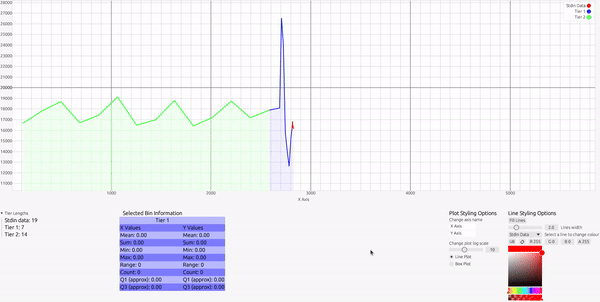

# Summarst

Maynooth 2024 Final Year Project\
Command line tool for GNU/Linux that plots x, y values moving through pipes, offering mechanism to gradually summarise data over time via data binning. 




## Install

```
$ git clone https://github.com/TKDuff/Rust-Plotting-Tool.git
$ cd Summarst
$ cargo build # or cargo build --release then navigate to /summarst/target/release to find binary
```

## How it Works
Summarisation works via hierarchical tiered data binning

* There exist multiple tiers, each with one condition on when to summarise data
* When condition met, data in tier summarised and pushed to next tier lower in hierachy
* As data moves down tiers, summarised more and more
* Exist three types of tier, in order

1) **Stdin Tier**
First tier, handles x,y values from stdin.\
When its condition is met, obtains aggregate statistics about x, y values\
Statistics put into  x bin & y bin\
Newly created bin pushed to next tier lower on hierarchy\

2) **Intermediate Tier**\
Only contains x & y bins\
Upon reaching condition, all bins in tier merged into single bin and pushed to next tier (lower in hierachy)

3) **Catch all Tier**\
Last tier, upon reaching condition, merges bins in chunks of a fixed size


## Usage
* **Use commands --h or --help for more in depth usage description**
* Insert it after or between pipes to pass the x,y values to the tool (from standard output)
* Specify summarisation policy
* Values must be **separated by a space, x y**\
* x, y values received from standard input printed back to standard output, delay of 27.7ns
* To view bin information, **click on a plot point**
* Can change plot type to be a box plot and styling (colour, axis name, widths)

## Policy Options
User sets
* Number of tiers that exist (max of 7, including stdin and catch all)
* Condition on when a tier summarise its data and push to next tier\

Two summarisation policies
1) **count** When tier reaches specified length
2) **interval** When specified unit time elapses (seconds, minutes, hours)

* Each tier defined by its condition, specify number for count or unit time for interval (S, M, H)
* Final (catch all) tier denoted by **XCY**, where X is condition and Y is chunk size to merge bins i.e
* 9C3 - merge bins in chunks of size 3, result 3 newly created (merged) bins
* If don't want to merge in chunks for final tier, can set **0C0**, it will accumulate bins without merging

## Examples
proc1 (process 1) prints x y values (seperated by a space) to standard out, received by summarst 

### count
```
$ proc1 | summarst count 10 20 50C2


# Every 10 x,y values aggregated into bin and pushed to next tier
# Every 20 bins merged into single bin and pushed to next tier
# Every 50 bins merged in chunks of size 2 (leave 25 bins)
```

### interval
```
$ proc1 | summarst interval 1S 1M 1H 0C0

# Every second obtain aggregate statistics about x, y values. Put them in respective x bin and y bin, push to next tier
# Every minute merge the tiers bin into a single bin, push to next tier
# Every hour, do the same
# No catch all policy, does not merge bins in chunks, will accumulate more bins over time
```

### No summarisation
If want to view raw plot of the x,y values with no summarisation, run the tool with no arguments
```
proc 1 | summarst
```

### Between pipes
As the x,y values received (from stdin) and printed back to standard output, the tool can be inserted between pipes. Does not mutate the x,y values
```
$proc1 | summarst | summarst count 5 0C0 | proc2

#proc 1 x,y values plotted by summarst with no gradual summarisation policy, raw plot of data
#outputted x,y values received by downstream summarst, which summarises via count, prints x,y values received back to standard output
#proc2 (process 2) receives the x,y values
```

### Limits
The maximum number tiers allowed is 7, the minimum tier conditions are...\
**count** - length of 1\
**interval** - 1 second per summary\
Catch all tier has minimum size of 1C1
```
$proc1 | summarst count 1 1 1 1 1 1 1C1
```